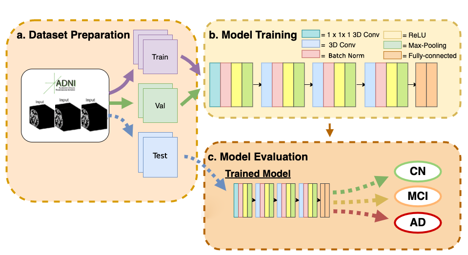

# Early Alzheimer’s Disease Detection from Structural MRIs Using Deep Learning

## 🧠 Overview

This project explores the use of **3D Convolutional Neural Networks (3D CNNs)** for early detection of Alzheimer’s Disease (AD) using structural magnetic resonance imaging (sMRI). Inspired by and building upon the work of [Liu et al. (2022)](https://www.nature.com/articles/s41598-022-20674-x), we aim to not only replicate but **enhance their deep learning architecture** using high-performance computing (HPC) resources, particularly the **MeluXina Supercomputer**.

The model classifies subjects into three categories:  
- **Cognitively Normal (CN)**  
- **Mild Cognitive Impairment (MCI)**  
- **Mild AD Dementia (AD)**  

Our work highlights the value of deep learning in automating and improving the diagnostic process for Alzheimer’s Disease, enabling scalable and efficient MRI-based screening.

---

## ✅ Contributions

- Re-implemented and validated Liu et al.’s 3D CNN model on the ADNI dataset   
- Used the **Clinica software suite** for standardized MRI preprocessing in BIDS format 
- Integrated  **data augmentation** techniques (Gaussian blurring, random cropping)  
- Leveraged **MeluXina HPC** for full-scale GPU-based training and evaluation  
- Achieved promising classification results with improved performance on the original paper

---

## 🏗️ Model Architecture



> *Note: Figure shows a placeholder representation of the deep learning architecture.*

The model architecture consists of:
- Multiple 3D convolutional blocks with normalization steps and ReLU activations  
- Fully connected layers for classification  
- Cross-entropy loss optimized with Adam  

---

## 📦 Data Pipeline

### Dataset: [ADNI](http://adni.loni.usc.edu/)

| session_id | participant_id | sex | original_study | diagnosis | ... |
|------------|----------------|-----|----------------|-----------|-----|
| ses-M006   | sub-ADNI052S0671 | F   | ADNI1          | LMCI      | ... |
| ses-M000   | sub-ADNI109S0967 | M   | ADNI1          | CN        | ... |
| ses-M000   | sub-ADNI027S0850 | M   | ADNI1          | AD        | ... |

## ⚙️ Preprocessing

To collect the MRI scans and utilize them correctly to train the model please refer to [INSTALL.md](INSTALL.md)

MRI scans were processed using the [Clinica software suite](https://www.clinica.run/):

1. Convert to **BIDS format**
2. Generate a **template** from the training set
3. Apply **spatial normalization** using the template
4. Apply **intensity normalization** to reduce scanner bias

This pipeline ensures data consistency across training, validation, and testing sets.

---

## 🔁 Data Augmentation

To improve generalization and model robustness, we applied:

- **Gaussian Blurring** 
- **Random Cropping**  

Augmentation is performed **on-the-fly** during training.

---

## 💻 Infrastructure: MeluXina Supercomputer

We worked on the GPU-enabled **MeluXina** system provided by EuroHPC.

### SSH Access

```bash
# ~/.ssh/config
Host meluxina
  Hostname login.lxp.lu
  User <user_id>
  Port 8822
  IdentityFile ~/.ssh/id_ed25519_mel
  IdentitiesOnly yes
  ForwardAgent no
```
To connect simply type on the command line
```bash
ssh meluxina
```

## 🚀 Benefits of MeluXina

* Large amount of GPU hours available

* Support for large batch sizes

* GPU parallelization capabilities

* Extended memory for ~1TB datasets  

---

## 🧪 Neural Network Training

- **Loss Function**: Cross-Entropy  
- **Optimizer**: Adam
- **Normalization**: InstanceNorm / BatchNorm   

Most of the model parameters can be tuned by modifying the [config.yaml](config.yaml) file.

---

## 📈 Results

> **NOTE:** Placeholder section. Insert metrics when available.

Expected outcomes based on Liu et al.:

- **AUC > xx%** for AD classification  
- Improved performance over ROI-volume/thickness-based models  
- Demonstrated progression prediction capabilities  

---

## 🖼️ Visualizations


TODO GradCAM

---

## 📂 Project Structure
```bash
├── python/                # Python Model
│   ├── model.py             # CNN architecture
│   ├── dataset.py           # Dataset preparation
│   └── train.py             # Main training script
├── cpp/                   # C++ Model
│   ├── model.h              # CNN architecture
│   ├── dataset.h            # Dataset preparation
│   └── train.cpp            # Main training script
├── utils/                 # Other code
│   ├── gradcam.py           # Visualize classification
│   ├── test.py              # Test results
│   └── plot.py              # Show loss
├── preprocess/            # Preprocessing scripts
├── data/                  # Diagnosis datasets 
├── envs/                  # Conda Environments
├── media/                 # Images/GIFs/...
├── config.yaml            # Model hyperparameters
├── INSTALL.md
└── README.md

```

## 🙏 Acknowledgements
- **Liu et al.** for their foundational model and research

- **MeluXina Support Team** for infrastructure and consultation

- **Clinica Developers** for powerful neuroimaging tools

- **MOX Lab @ Politecnico di Milano** for support and guidance

## 📬 Contacts
```bash
├── Vittorio Pio Remigio Cozzoli, Student, Politecnico di Milano
│     ├── vittoriopio.cozzoli@mail.polimi.it
├── Tommaso Crippa, Student, Politecnico di Milano
│     ├── tommaso2.crippa@mail.polimi.it
├── Alberto Taddei, Student, Politecnico di Milano
│     ├── alberto4.taddei@mail.polimi.it
```


